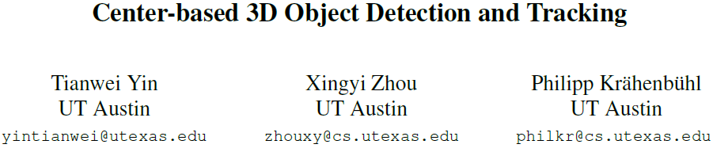
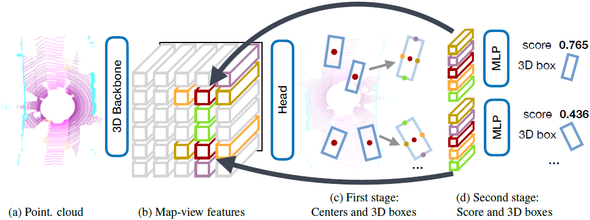
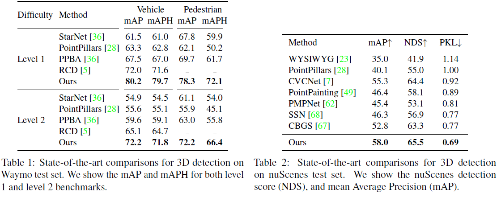
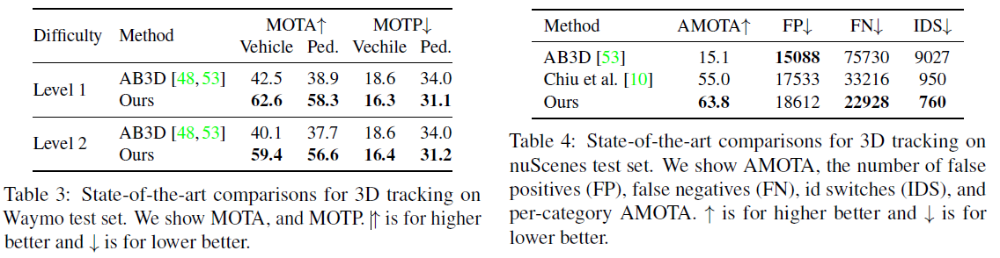
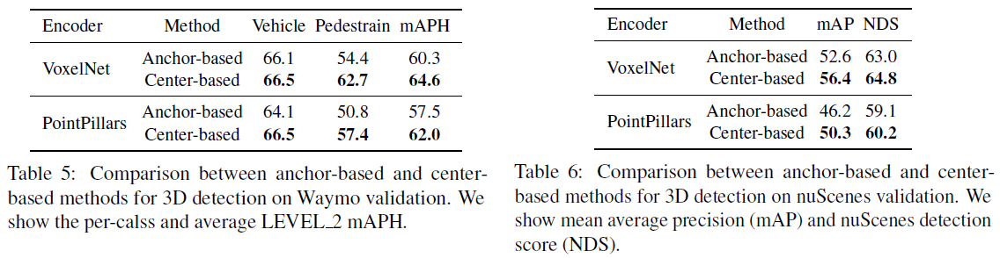
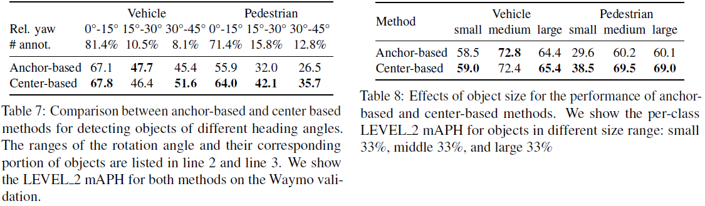
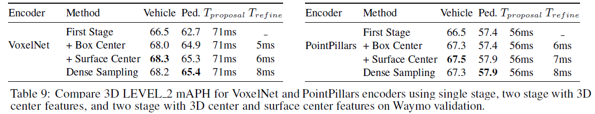
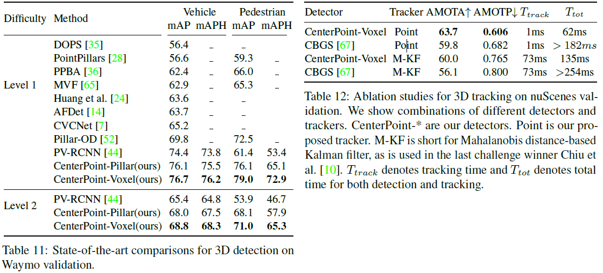
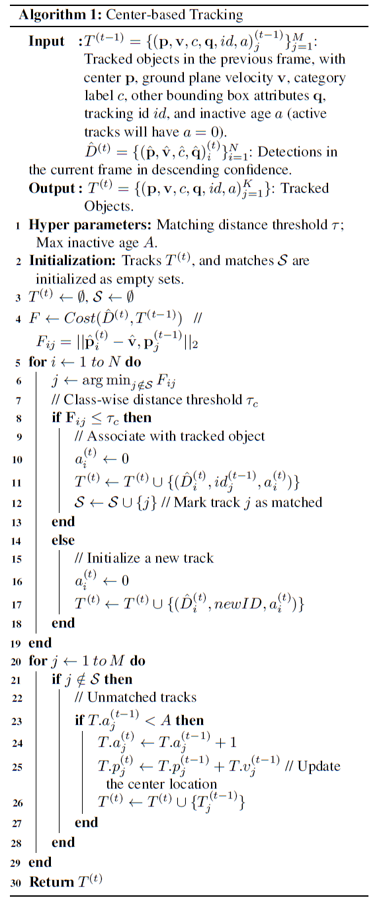

[toc]

# Center-based 3D Object Detection and Tracking

## Abstract

- 3维物体在点云中以3d boxes形式表征，这种形式借鉴了已经非常成熟的图像中的2d bounding-box，但是却有一些其他的问题。朝向(orientation)，box-based方法很难拟合旋转目标
- 本文提出两阶段的keypoint based方法来实现检测和跟踪
- 第一阶段通过keypoint检测到中心点，并回归预测出其他属性，如3D size, 3D orientation, and velocity
- 第二阶段使用目标上的其他point features来优化预测值，再通过greedy closest-point matching实现跟踪
- 在nuscens上单模型达到65.5 NDS，63.8 AMOTA，在waymo上也处于领先
- https://github.com/tianweiy/CenterPoint

## Introduction

- **在点云上的3d目标检测的困难**：
  - 点云是稀疏(sparse)的，大多数区域都是without measurements
  - 预测出的box通常不与任何全局坐标系对齐(not well aligned withglobal coordinate)
  - 目标的sizes, shapes, and aspect ratios变化很大

- **2d与3d检测之间的差异**导致一些方法表现并不理想(Point-rcnn、Complex-yolo、3dssd)
- axis-aligned 2D box并不能很好地代表free-form 3D object，而引入anchor则会增加计算量，带来大量potential false-positive(R3det、Scrdet)
- 用**关键点表示目标能简化3d目标的识别**
  - 本文提出的方法利用keypoint detector(centernet)找到目标中心点以及其他属性并在第二阶段优化所有预测值
  - 具体来说，使用标准的Lidar-based网络(Second、Voxelnet、Pointpillars)来提取输入点云的特征
  - 然后将特征映射为BEV视角(flattens into map-view)下，并使用image-based网络来预测中心点
  - 对每个中心，用它的点特征回归出其他属性，并使用轻量级二阶段网络来优化
  - 二阶段网络在目标3d box的每个面的中心点提取point-features，用于重建因stride和receptive field而丢失的特征

- **基于中心点的方法的优点**
  - 相比于boxes，points没有方向上的限制，减少了算法的search space，使得backbone能学习到目标的旋转不变性和相对旋转的等变性(rotational invariance and rotational equivariance of relative rotation)
  - 中心点的表示方法有利于下游任务的实现，如跟踪
  - 基于点的方法使得特征提取更快、更有效
- 在Waymo和nuScenes数据集上验证了方法的有效性

## Related work

- **2D object detection**：从图像中预测axis-algined bounding box。二阶段的RCNN系列，单阶段的YOLO、SSD、RetinaNet系列；基于中心点的CenterNet、CenterTrack等
- **3D object detection**：从图像或点云或融合的输入预测rotated bounding boxes，与2d区别在于输入数据的encoder
  - Vote3Deep利用feature-centric voting，VoteNet使用point feature vote clustering
  - VoxelNet利用PointNet提取voxel特征，使用了sparse convolutions和2D convolutions，SECOND提高了sparse 3D convolutions
  - PIXOR将3d投影到2D feature map以减少计算量，额外信息包括3D occupancy and point intensity
  - Pointpillars将voxel替换为pillars提高了运算速度
  - MVF和Pillar-od方法结合multiple view features来学习更加高效的pillar representation
  - 本文的方法只关注output representation，因此对任何3D encoder都兼容

- **Two-stage 3D object detection**：Pv-rcnn、Pointrcnn、From points to parts、Std等方法，利用了RoIAlign或RoIPool来在3d空间中提取RoI-specific features，但多数耗时太长，因此本文只从5个面中心点提取特征
- **3D object tracking**：很多2d跟踪方法都能直接跟踪3d目标，而3D Kalman filters仍具有优势，本文则基于CenterTrack使用速度估计和基于点的检测来跟踪目标

## Preliminaries

- **2D CenterNet**将目标检测当作关键点估计keypoint estimation
  - 输入图像，为$K$个类别预测$w \times h$的热图heatmap：$\hat{Y}\in \left[ 0,1 \right] ^{w \times h \times K}$，其中每个局部最大值(8像素邻域)就对应一个目标的中心
  - 此外还回归出所有类别共享的size map：$ \hat{S}\in R^{w \times h \times 2}$，对每个目标，size-map保存了center location的宽和高
  - 整体架构为fully convolutional image backbone，最后输出dense prediction head
  - 训练时，CenterNet在每个类别$c_{i}\in \left\{ 1 \cdots K \right\} $的每个目标的中心点$q_i$学习，去预测用高斯核渲染的heatmaps(rendered with Gaussian kernels)，并且回归目标大小$S$，此外为减少backbone的stride的量化误差，还回归一个局部偏移$\hat{O}$
  - 测试时，网络生成$K$个heatmaps和class-agnostic regression maps，每个局部最大值对应于一个目标，置信度与热图值成比例，根据下游应用，可能采用Non-Maxima Suppression (NMS)

- **3D Detection**对于一帧无序点云$P= \left\{(x,y,z,r)_{i}\right\}$，预测一系列3d boxes$B= \{b_{k}(u,v,d,w,l,h,\alpha)\}$
  - 通常使用3D encoder来编码量化点云为规则的某种形式，如voxel、pillars
  - 随后利用point-based网络提取其中的特征
  - 继而pools these features，输出map-view feature-map：$M \in R^{ W\times L \times F}$
  - 其中宽高WL则与点云编码量化的分辨率和backbone的stride直接相关
  - 在此特征基础上，predefined anchor on this feature-map，实现one or two-stage的检测方法
  - 但是anchor-based方法可能难以拟合出axis-aligned 2D box to a 3D object

## CenterPoint

- **CenterPoint 第一阶段**，3D backbone输出了$M \in R^{ W\times L \times F}$的特征图，head预测出：
  - class-specific heatmap and object size
  - sub-voxel location refinement
  - rotation and velocity
- **Center heatmap head**在heatmap上的目标中心点产生peak
  - 将3d box及其中心点投影到map-view产生2D Gaussian，通过focal loss学习预测出$K$通道的heatmap$\hat{Y}$
  - 在这样的视角下，目标会比图像中更加稀疏，并且不受perspective的distorts影响
  - 此时heatmap上大多数区域将被认为是背景，监督信号较弱，因此本文增大了正样本中心点的高斯峰值
  - 即$ \sigma =max(f(wl), \tau)$，其中$\tau=2$是设定的最小高斯半径，$f$是centernet定义的半径函数

- **Regression heads**在目标的center-features上保存几项目标属性
  - sub-voxel location refinement用于降低voxelization和backbone的量化误差
  - height-above-ground离地高度帮助定位3d目标，并且恢复map-view移除的高度信息
  - 3D size and a yaw rotation angle，角度回归是连续的sine and cosine of the yaw
  - 对ground truth centers使用L1 regression loss，对size使用logarithmic来缓解目标的various shapes
  - 所有预测都是dense的，因此可以使用indexing对应到heatmap的peak上

- **Velocity head and tracking**通过为每个目标预测二维的velocity estimation作为额外的回归输出
  - 需要输入两帧序列数据，通过L1损失监督
  - 推理时可以用SORT来greedy匹配，即将当前帧的速度取负后投影回上一帧，匹配距离最近的目标

- 上述所有heatmap和regression损失将被jointly optimizes，但是因为所有属性都是从中心点特征预测出来的，造成预测localization缺少足够的信息，难以预测准确(**sensor often only sees the side of the object, but not its center**)

- **CenterPoint 第二阶段**提取额外的point-features
  - 从预测的3d box的每个面的中心提取一个点特征，此时顶部、和底面重合，因此只考虑4个面和中心的特征
  - 对每个点，使用双线性插值从backbone map-view的输出提取特征，concatenate之后通过MLP来pass through
  - 第二阶段主要输出class-agnostic confidence score和box refinement
  - 根据Pv-rcnn等论文的方法，采用3D IoU的方式预测class-agnostic confidence score，通过binary cross entropy loss监督
  - 其中$IoU_{t}$表示第$t$个proposal box和ground-truth的IoU，$\hat{I_{t}}$是预测的confidence score
  - 注意推理时直接采用了第一阶段的class prediction，最终confidence score为$\hat{Q_t}$，其计算方式为两个分数的几何平均值：$ \hat{Q}_{t}= \sqrt{\hat{Y_{t}}* \hat{I}_{t}}$

$$
I= \min(1,max(0,2 \times IoU_{t}-0.5))\\
L_{score}=-I_{t}\log(\hat{I}_{t})-(1-I_{t})\log(1- \hat{I}_{t})
$$

- **Architecture**
  - 第一阶段网络共享$3\times 3$ conv + BN + ReLU，然后每个head各自使用两个$3\times 3$ conv + BN + ReLU
  - 第二阶段使用shared two-layer MLP + BN + ReLU + Dropout(0.3)，两个分支分别3层fully-connected layers，one for confidence score and one for box regression prediction

## Experiments

- 两种encoders：VoxelNet、PointPillars，两个数据集：Waymo Open Dataset和nuScenes Dataset
- 对于Waymo(64线)，距离范围为$[-75.2,75.2]\times[-2,4]$，voxel大小$(0.1,0.1,0.15)$，pillar大小$(0.32,0.32)$
- 对于nuScenes(32线)，距离范围为$[-51.2,51.2]\times[-5,3]$，voxel大小$(0.1,0.1,0.2)$，pillar大小$(0.2,0.2)$
- **3D detection results**，CenterPoint-Voxel单模型

- **3D Tracking**，velocity-based closest distance matching

- **Center-based vs Anchor-based**，对比one-stage centerpoint和anchor-based方法

- **different heading angles and object size**

- **One-stage vs Two-stage**

- **Voxel-Set Abstraction & Radial basis function (RBF) Interpolation**
  - PV-RCNN提出的VSA和PointNet++提出的RBF
  - 实验证明并无太大作用

- **compare with prior work**

## Conclusion

- 提出一个基于中心点的算法框架，用于从点云中同时检测和跟踪3d目标。基于标准的3D点云encoder，生成BEV heatmap和其他dense回归预测。检测是依据局部峰值提取和优化，跟踪依据最近邻匹配。CenterPoint简单、近实时，并在Waymo和nuScenes基准测试中取得了最佳的性能。

## A. Tracking algorithm

## B. Implementation Details

- 代码基于https://github.com/poodarchu/Det3D实现
- nuScenes数据集的常见做法是将未注释帧的点云transform and merge到注释的点云中以产生更加稠密的点云
- 数据增广：X/Y轴的random flipping，global scaling，global rotation，ground-truth sampling
- 在检测头上增加separate deformable convolution layers可以使点数提高