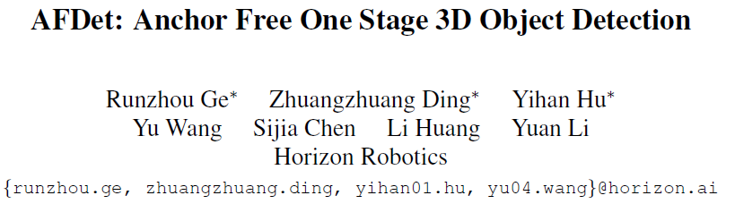
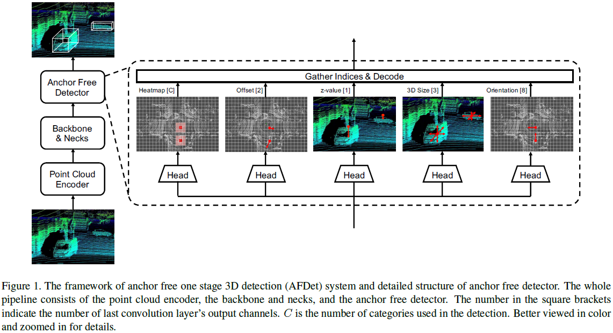
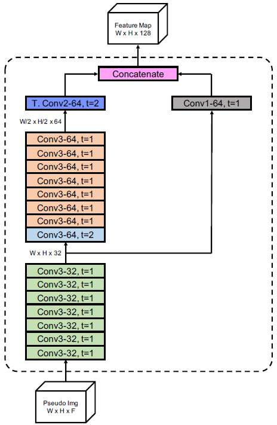
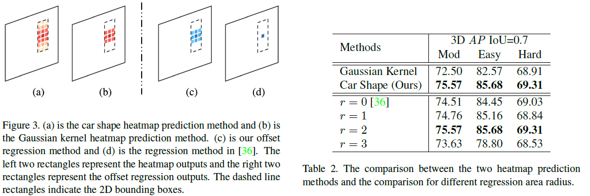
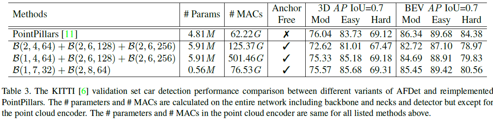
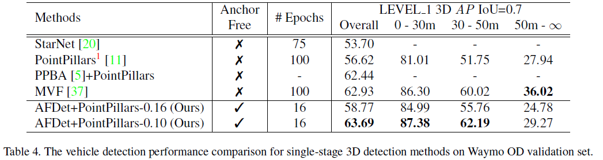

[toc]

# AFDet: Anchor Free One Stage 3D Object Detection

## Abstract

- 在嵌入式系统上高效的点云3d目标检测算法十分重要，以往的anchor-based方法具有两个缺点：复杂的后处理耗时以及anchor的参数调整
- 本文提出anchor free以及NMS free的单阶段算法AFDet，在KITTI和waymo上性能超越其他anchor-based方法

## Introduction

- 实现自动驾驶的关键之一是需要embedded systems friendly的算法，而由于点云的稀疏性，直接在原始点云上使用3d或2d卷积是低效的
- 因此需要point cloud encoders将其编码为某种data formats，如Voxelnet、MVF、Second、Pointpillars等，也有直接处理点的PointNet系列，Pointrcnn、Starnet等
- 在检测部分，大多数都采用图像中的anchor-based方法，其有两个缺点，即存在大量overlapped high confident boxes需要NMS，带来不必要的计算量；此外anchor selection也是tricky的，需要调试anchor number、size、angle、density等
- 参考近期图像的anchor free工作，Cornernet、centernet、FCOS，本文提出anchor free and NMS free one stage end-to-end point cloud 3D object detector (AFDet)，只需要简单的后处理
- 使用PointPillars作为encoder到pseudo images提取BEV feature，然后CNN + neck，输出keypoint heatmap，后接5个不同的head预测目标

## Related Work

- **LiDAR-based 3D Object Detection**
  - voxel encoder：利用density, intensity, height等特征信息体素化点云，projected to 不同视角，如BEV、RV，用2D conv or sparse 3D conv处理，如MV3d、Complex-yolo、Pixor
  - point encoder：使用Multilayer Perceptron(MLP)直接处理点云，如PointNet++、PointRCNN、STD等
  - 结合二者，VoxelNet、SECOND使用Voxel Feature Extractor(VFE)，即用pointnet类型的网络提取voxel特征，PointPillars编码pillars特征
  - Anchor free，3D proposal、voted interest points等
- Camera-based 3D Object Detection
  - MonoDIS、CenterNet、TTFNet、RTM3D

## Methods

### Point Cloud Encoder

- 可以使用任何能产生pseudo images的point cloud encoder，考虑实时性，使用pointpillars
- 将detection range在BEV下划分为pillars，并扩充到9维特征，采样固定的pillars和固定的points，随后用linear layer加max operation创建输出特征，所选的P个pillars需要scatter到原来的detection range里

### Anchor Free Detector

- **5 detection head**，每个head都是2个conv
  - keypoint heatmap head：$\hat{M} \in R^{W \times H \times C}$，C是类别数，用于预测目标中心
  - local offset head：$\hat{O} \in R^{W \times H \times 2}$，精确定位目标，同时减少pillarization量化误差
  - z-axis location head：$\hat{Z} \in R^{W \times H \times 1}$，预测高度
  - 3D object size head：$\hat{S} \in R^{W \times H \times 3}$，预测目标大小
  - orientation head：scalar angle rotated around z-axis

- 对3d目标k，其类别为$c_k$，box为$(x^{(k)},y^{(k)},z^{(k)},w^{(k)},l^{(k)},h^{(k)}, \theta ^{(k)})$，此外$[(x),(y)]$检测范围$[(back,front),(left,right)]$，定义pillars尺寸$b$ (square)
  - 根据cornernet，在BEV上为每个目标中心点生成关键点：$p=(\frac{x^{(k)}-back}{b}, \frac{y^{(k)}-left}{b})\in R^{2}$
  - 及其在keypoint heatmap上的预测：$ \tilde{p}= \lfloor p\rfloor$
  - BEV上的2d box：$(\frac{x^{(k)}-back}{b}, \frac{y^{(k)}-left}{b}, \frac{w^{(k)}}{b}, \frac{l^{(k)}}{b}, \theta ^{(k)})$
  - 在BEV上的每个像素，在2d box内时，根据像素点和中心点的欧式距离为其赋值：$M_{x,y,c}= \left\{ \begin{matrix} 1, \quad d=0 \\ 0.8, \quad d=1 \\ \frac{1}{d}, \quad else \\ \end{matrix} \right.$，当$\hat{M}_{x,y,c}$为1时表示中心点，为0时表示背景点

- 使用修改版focal loss监督heatmap，N是在detection range内的目标数

$$
\mathcal{L}_{\text {heat }}=-\frac{1}{N} \sum_{x, y, c}\left\{\begin{array}{c}\left(1-\hat{M}_{x, y, c}\right)^{\alpha} \log \left(\hat{M}_{x, y, c}\right), \text{if} \ M_{x,y,c}=1\\ \left(1-M_{x, y, c}\right)^{\beta}\left(\hat{M}_{x, y, c}\right)^{\alpha} \log \left(1-\hat{M}_{x, y, c}\right),\text{else} \end{array}\right.
$$

- 使用L1损失监督offset，降低pillarization误差的同时也可以修复centers预测错误的情况。用目标中心半径r的square区域，regression map

$$
\mathcal{L}_{\text {off }}=\frac{1}{N} \sum_{p} \sum_{\delta=-r}^{r} \sum_{\epsilon=-r}^{r}\left|\hat{O}_{\tilde{p}}-b(p-\tilde{p}+(\delta, \epsilon))\right|
$$

- 使用L1损失监督高度预测

$$
\mathcal{L}_{z}=\frac{1}{N} \sum_{k=1}^{N}\left|\hat{Z}_{p^{(k)}}-z^{(k)}\right|
$$

- 使用L1损失监督size

$$
\mathcal{L}_{size}=\frac{1}{N} \sum_{k=1}^{N}\left|\hat{S}_{p^{(k)}}-s^{(k)}\right|
$$

- 方向预测，参考[1](3d bounding box estimation using deep learning
  and geometry)/[2](Objects as points)，分bin的softmax classification和angle regression

$$
\begin{array}{l}\mathcal{L}_{\text {ori }}=\frac{1}{N} \sum_{k=1}^{N} \sum_{i=1}^{2}\left(\operatorname{softmax}\left(\hat{\mu}_{i}^{(k)}, \eta_{i}^{(k)}\right)\right. \left.+\eta_{i}^{(k)}\left|\hat{\nu}_{i}^{(k)}-\nu_{i}^{(k)}\right|\right) \\\end{array}
$$

- 总损失：$ \mathcal{L}=\mathcal{L}_{\text {heat }}+\lambda_{\text {off }} \mathcal{L}_{\text {off }}+\lambda_{z} \mathcal{L}_{z}+\lambda_{\text {size }} \mathcal{L}_{\text {size }}+\lambda_{\text {ori }} \mathcal{L}_{\text {ori }} $

- Gather indices and decode：训练时只back-propagate目标中心而不是整个feature map，推理时用max pooling AND从keypoint heatmap获取peaks，比NMS快的多，最后加上偏移量获取输出目标

### Backbone and Necks

## Experiments

- kitti和waymo数据集实验
  - kitti范围$[(0,70.4),(-40,40),(-3,1)]$生成$416\times 480\times 64$的pseudo images
  - waymo范围$[(-76.8,76.8),(-76.8,76.8),(-3,5)]$
- AdamW optimizer with one-cycle policy
- Data Augmentation

### Evaluation

- **car shape heatmap and Gaussian kernel heatmap**

- **KITTI car AP**

- **Waymo OD validation**

## Conclusion

提出anchor free one stage 3D object detector (AFDet)
