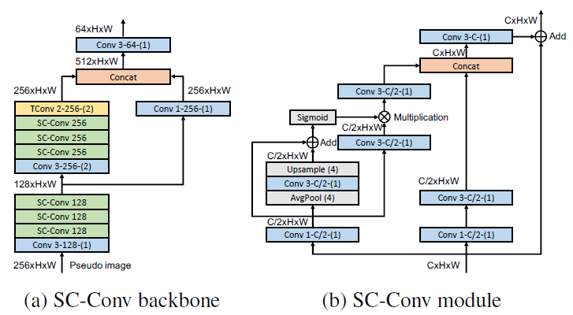
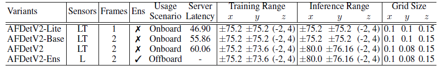
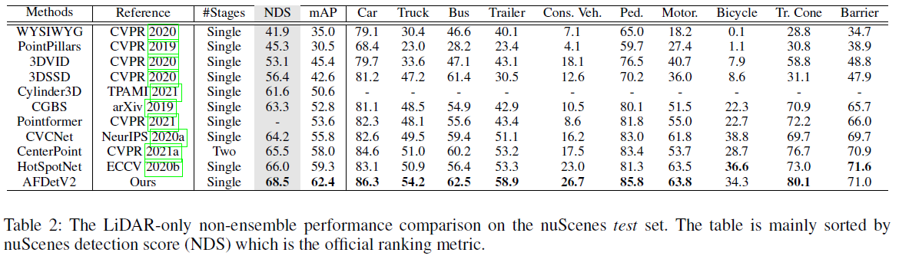
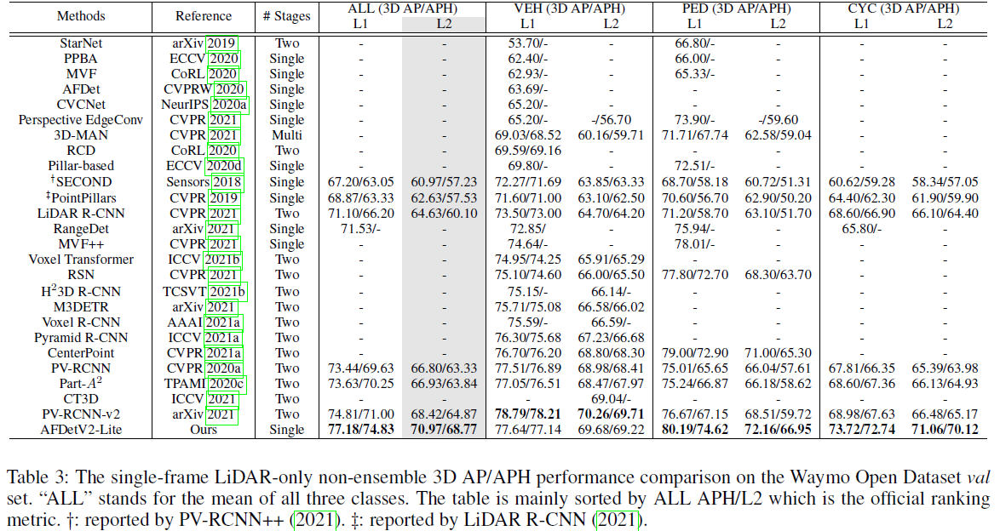
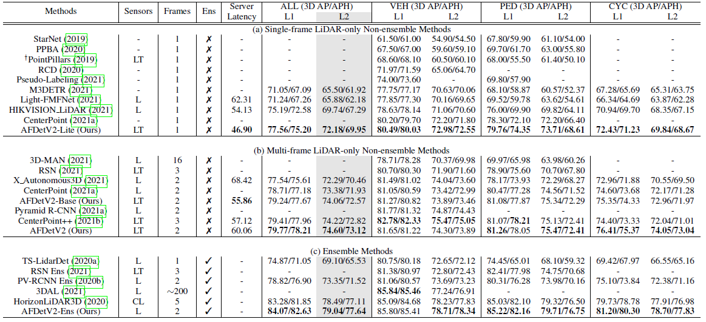
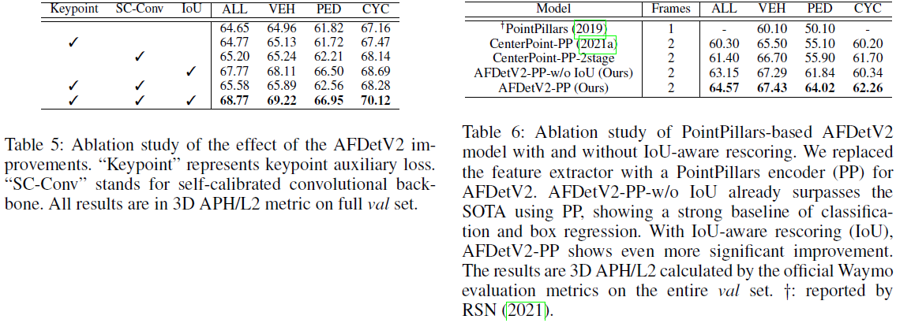
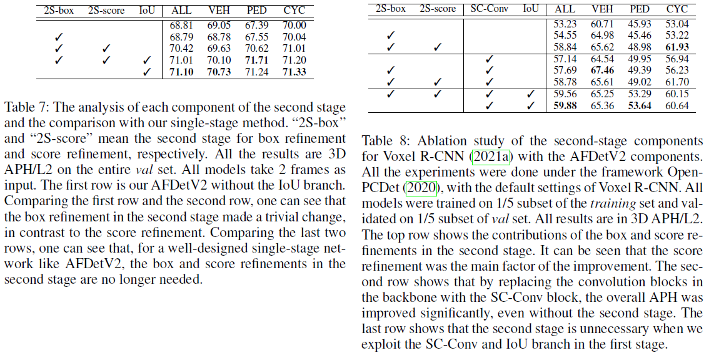

[toc]

# AFDetV2: Rethinking the Necessity of the Second Stage for Object Detection from Point Clouds

## Abstract

- 目前两种点云3d目标检测主流：single-stage和two-stage，本文研究发现first stage可以产生更加准确的box，此时second stage主要用于更准确的localization
- 本文设计了single-stage anchor-free network AFDetV2，在backbone中加入**self-calibrated convolution block**，增加**keypoint auxiliary supervision**，以及在多任务头中增加**IoU prediction branch**
  - 将predicted IoU score与classification heatmap相乘形成最终的类别得分
  - 改进的backbone有利于box localization
  - rescoring方法有效地结合了object presence confidence 和box regression accuracy

- 在waymo和nuscenes上实现SOTA(包括single和two stage)，并且获得Most Efficient Model

## Introduction

- single-stage：AFDet、VoxelNet、SECOND、SA-SSD、CIA-SSD、PointPillars、[RCD](Range Conditioned Dilated Convolutions for Scale Invariant 3D Object Detection)、Rangedet、[EVC](Every View Counts: Cross-View Consistency in 3D Object Detection with Hybrid-Cylindrical-Spherical Voxelization)
- two-stage：PointRCNN、STD、PointNet++、PartA2、LiDAR R-CNN、PV-RCNN++、Voxel R-CNN、CenterPoint、RSN
- second stage的重要性在于point features可以恢复voxelization造成的positioning误差以及缺失的receptive field，同时classification的confidence map和regression的localization可能并不align well(即classification score缺少localization information，而对目标检测来说需要综合考虑二者)
- 但是近来一些voxel-based方法证明voxel features 同样能达到point-based features的定位效果，所以second stage仅仅是用额外的计算来提高classification score和加强box regression
- 本文发现first stage已经足够产生准确的box localization，因此second stage作用在于加强classification scores
- 关于如何解决misalignment问题，近期的2d工作VarifocalNet就提出IoU-aware classification score来提高localization accuracy，并且3d工作CIA-SSD也提出IoU regression branch结合了classification score rescoring
- 本文工作接近CIA-SSD，但有以下几点不同
  - 本文为anchor-free，从[AFDet](AFDet: Anchor Free One Stage 3D Object
    Detection)扩展而来，而CIA-SSD为anchor-based
  - 本文提出带有multi-scalability和spatial attention的[self-calibrated conv](Improving Convolutional Networks with Self-Calibrated Convolutions)模块，在backbone中起到增大receptive field以及加强semantics的作用
  - 进一步增强box regression，基于3D boxes的4角点和中心点建立auxiliary loss
  - 在single-stage和two-stage之间做了大量实验，证明二阶段网络refining没有必要，同时，为了align：classification score与box regression，利用了IoU prediction branch，修改了rescoring formula

- 本文方法在Waymo Open Dataset和nuScenes Dataset上都实现领先，且证明几个组件：self-calibrated block, keypoint auxiliary loss, and the IoU prediction branch，都能帮助以往的一些方法涨点，如Voxel R-CNN

## Related Work

**Two-Stage LiDAR Detector**

- first stage产生Region of Interests (RoIs)，second stage做refine；如PointRCNN、STD，产生proposal后，用PointNet++提取proposals内的point features，然后pool到二阶段refinement，但是不同proposals有可能汇聚到同一组点，造成geometric information的丢失
- Part-A2设计了RoI-aware point cloud pooling
- LiDAR R-CNN设计了virtual point and boundary offset
- PV-RCNN则通过MLP汇聚point and voxel-wise feature到set of keypoints
- Pyramid R-CNN利用RoI-grid pyramid解决sparsity问题
- Voxel RCNN通过voxel-RoI pooling直接从voxel and BEV feature提取
- 为了提高处理速度，CenterPoint则通过bilinear interpolation简化到five keypoints
- RSN利用了foreground segmentation作为first stage来稀疏化点云，提高了second stage稀疏卷积的效率

**Singe-Stage LiDAR Detector**

- VoxelNet编码的3D voxels，利用到3D conv，非常耗时
- SECOND利用3D sparse conv加速计算
- PointPillars则通过BEV pillars的形式加速encoding，同时可利用2d conv
- CIA-SSD提出IoU prediction branch和一种post-processing method
- AFDet提出anchor-free and NMS free方法

**Different Views**

- Range Conditioned Dilated Convolutions for Scale Invariant 3D Object Detection
- Rangedet: In Defense of Range View for LiDAR-Based 3D Object Detection
- Every View Counts: Cross-View Consistency in 3D Object Detection with Hybrid-Cylindrical-Spherical Voxelization
- End-to-End Multi-View Fusion for 3D Object Detection in LiDAR Point Clouds

**Anchor-Based LiDAR Detector**

- 大部分工作都基于anchor：PointPillars、SECOND、VoxelNet、Voxel-FPN、[CBGS](Classbalanced Grouping and Sampling for Point Cloud 3D object
  Detection)、STD提出新的spherical anchor

**Anchor-free LiDAR Detector**

- 基于关键点，AFDet、RSN、CenterPoint++，目标的centerness
- 多帧预测，3D-MAN：3D Multi-frame Attention Network for Object Detection

## Methods

### Analysis on Two-stage Methods

- 使用二阶段的主要原因：恢复被一阶段RoI限制的spatial range，通过point feature重建3D context；用额外的计算来refine一阶段结果
- Voxel R-CNN证明通过使用小尺度的voxel(0.1m, 0.1m, 0.15m)，voxel base方法可以接近point bsae方法，同时CenterPoint也只通过voxel base feature实现了SOTA
- 进一步探究box regression、classification score以及他们之间的alignment问题
  - 本文依次将分类和回归分支添加到single-stage网络中，发现单独添加box regression分支时并无任何改进，但是添加score refinement确实有提高
  - 本文在第一阶段加入合适context features来尝试提高classification score，实验加入self calibrated conv确实提高不少，但距离二阶段还是有些差距
  - 继续对分类分支增加IoU alignment，即在backbone基础上添加IoU prediction branch，再将IoU branch和classification branch相乘，得以超越二阶段的结果

### Backbone

- Encoder部分voxelize参考voxelnet和CBGS，计算每个voxel内点的均值作为representative value
- 3D Feature Extractor部分参考SECOND，生成BEV pseudo image
- Multi-scale backbone部分用Self-Calibrated Convolutions(SC-Conv block)替换标准3x3卷积

### Anchor-Free Head

- 在AFDet的5个heatmap head基础上增加一项IoU-aware confidence score prediction和keypoint auxiliary loss
- CIA-SSD将IoU prediction head应用到anchor-based方法中，本文则用到anchor-free中，与cls score结合：$ f=score^{1-\alpha} * i o u^{\alpha} $，作为rescoring
- 根据CenterNet3D引入Keypoint auxiliary supervision，增加额外的heatmap为每个目标预测4角点和中心点

### Loss

$$
\begin{aligned} \mathcal{L}=\mathcal{L}_{\text {heat }}+ & \lambda_{\text {off }} \mathcal{L}_{\text {off }}+\lambda_{z} \mathcal{L}_{z}+\lambda_{\text {size }} \mathcal{L}_{\text {size }}+ \lambda_{\text {ori }} \mathcal{L}_{\text {ori }}+\lambda_{\text {iou }} \mathcal{L}_{\text {iou }}+\lambda_{k p s} \mathcal{L}_{k p s}\end{aligned}
$$

其中target axis-aligned 3D IoU计算：$(2*iou-0.5)\in[-1,1]$

## Experiments

- nuScenes和waymo实验，设置voxel size $[0.075,0.075,0.2]$，距离范围$[\pm54,\pm54,(-5,3)]$

- AFDetV2-Lite, AFDetV2-Base, AFDetV2 and AFDetV2-Ens，其中L表示所有Lidar，LT表示top Lidar，Ens即ensemble
  - AFDetV2-Lite：训练集18 epochs后finetune trainval 集18 epochs
  - AFDetV2-Base：10+36
  - AFDetV2：在base基础上继续36 epochs(smaller grid size)
  - AFDetV2-Ens：Test-Time Augmentation+model ensemble

- Stochastic Weights Averaging (SWA)
- Latency optimization
  - GPU处理voxelization和range images to point clouds
  - 除head外模型切换为half-precision
  - 将BN参数merge到3D Sparse Conv
  - 推理时disable keypoint auxiliary branch

- **Comparison with State-of-the-art Methods**

- Ablation Studies of AFDetV2 improvements

- Analysis of two-stage vs. single-stage

## Conclusion

提出real-time single-stage anchor-free 3D object detection model AFDetV2
