[toc]

# PillarNet: Real-Time and High-Performance Pillar-based 3D Object Detection
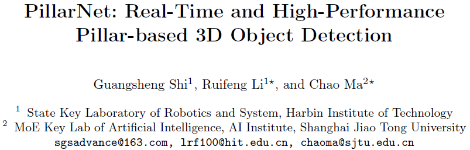

## Abstract

- 实时高性能的3d检测算法在自动驾驶领域具有重要作用，但是目前主流的point-based和voxel-based算法在使用3d卷积的计算上inefficient for onboard deployment；对比之下pillar-based方法仅使用2d卷积，对计算资源的需求更小，但在accuracy方面有所欠缺
- 本文研究了pillar和voxel-based方法的performance gap，提出一个高性能且实时的pillar-based方法，PillarNet，包括一个高效的pillar feature encoder、一个特征语义融合的neck network，以及通用的检测头
- 仅使用2d卷积的情况下，能够支持经典的backbone，并且受益于orientation-decoupled IoU regression loss和IoU-aware prediction，算法在nuScenes和Waymo数据集上达到state-of-the-art
- https://github.com/agent-sgs/PillarNet

## Introduction

- 目前大多数算法都有heavy computational load和large memory storage的问题，因此real-time speed for the onboard deployment十分必要
- 经典分类：3D voxel-based、2D pillar-based，架构：encoder-neck-head
  - voxel方法使用sparse 3D conv做encoder来学习geometric representation，然后用2D conv组成neck，接上detection head；sparse 3D CNN提供强大的特征学习能力，但是在aggregate multi-scale features方面有困难。Afdetv2、Second、Cia-ssd、Voxelnet
  - pillar方法投影到BEV上的2d pseudo-image，然后2D CNN提取特征，能够设计出轻量的网络，并且由large initial pillar生成的small sized pseudo-image造成其丢失许多重要信息。Pointpillars、Voxel-fpn、Hvnet、Hvpr
- 观察到以往的pillar-based方法没有足够的feature encoding，因此提出PillarNet，包括hierarchical deep pillar feature的encoder，以及multi-scale feature fusion的neck，加上center-based detect head
  - encoder包括5 stages，1~4使用2d sp conv；5则使用标准2d conv
  - neck融合4和5的特征
  - 调整hard-balanced pillar size

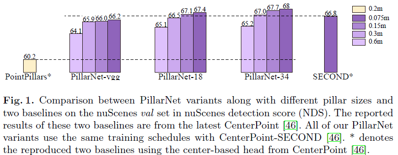

## Related Works

- **Point-based**：基于PointNet、PointNet++，大多数方法90%的时间都在处理点而不是在提取特征
  - PointRCNN提出point-based proposal generation + refine by RoI pooling
  - STD在proposal内变换point features到voxel representation用于RoI feature
  - 3DSSD提出F-FPS
- **Grid-based**：基于3D voxels and 2D pillars
  - VoxelNet划分3D voxels并应用3D convolutions
  - SECOND使用3D sparse convolution解决empty voxels的问题
  - PointPillars使用2D voxelization然后基于PointNet实现per-pillar feature extractor
  - MVF利用multi-view features增强point-wise information后投影到pseudo-image
  - HVNet在point-wise leve融合了different scales of pillar features
  - HVPR则保留了pillar-based的高效并且利用了voxel-based feature

- **Multi-sensor**：结合camera image and LiDAR point cloud
  - MV3D设计3D object anchors并从BEV上生成proposals，然后用多传感器特征融合做refine
  - AVOD在proposal generation阶段融合多传感器特征
  - ContFuse融合图像和点云特征到BEV空间
  - 。。。

## PillarNet for 3D Object Detection

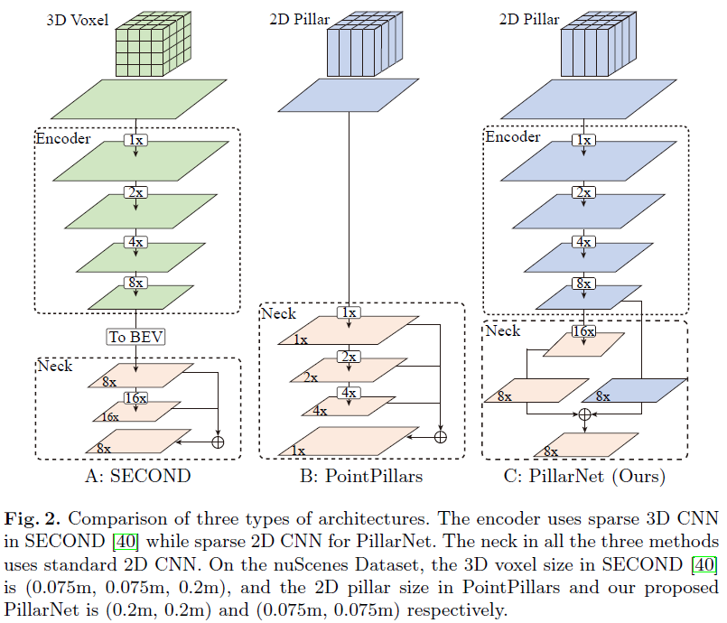

### Preliminaries

- grid-based(voxel & pillar)方法一般在BEV space检测3d目标，目前很多方法都遵循SECOND、VoxelNet、PointPillars
- **SECOND**
  - hierarchically encoder，1x，2x，4x，8x downsample
  - multiple scales top-down neck module
  - detect head

- **PointPillars**
  - projects to X-Y plane，tiny PointNet to sparse 2D pseudo-image
  - top-down neck network，1x，2x，4x multi-scale features
  - detect head
- **Analysis**
  - PointPillars的推理时间和效率都很优秀，但性能远远落后于SECOND
  - 3D稀疏卷积具有优越的点云特征学习能力
  - pillar-based方法的性能瓶颈主要在于encoder的feature learning和neck的feature fusion
    - PointPillars直接将FPN用在pseudo-image上，缺少空间稀疏信息
    - 最终输出的feature maps和初始的pillar scale耦合增加了计算和存储消耗
  - 本文将3D稀疏卷积替换为在pillar features上的2D稀疏卷积，增强neck的空间语义特征融合，构建了PillarNet，heavyweight sparse encoder + lightweight neck module

### PillarNet Design for 3D Object Detection

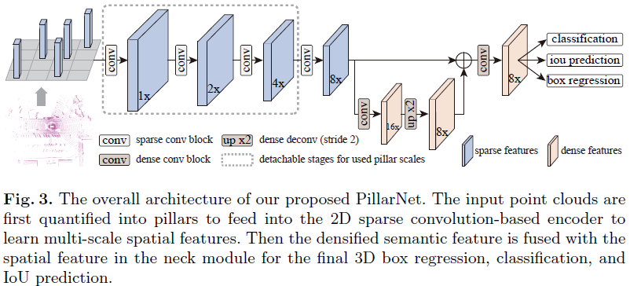

- **Encoder design**，相比pointpillars，提出的sparse encoder可以利用2d backboe改善3d特征学习，且hierarchically降采样可以学习不同pillar sizes下的特征，解耦了pillar size和feature maps

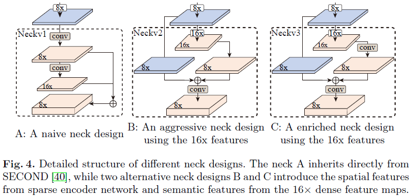

- **Neck design**，结合high-level abstract特征和low-level fine-grained特征，添加16x降采样来加强大目标的感受野，有两种设计：
  - neckv1原始SECOND，top-down生成multi-scale features后concatenate作为输出
  - neckv2考虑到附加的16x 降采样特征
  - neckv3再增加一个卷积来enriches 16x 降采样特征

### Orientation-Decoupled IoU Regression Loss

- IoU metric与localization和classification的质量高度相关，Rangeioudet提出使用3D IoU quality来监督分类和回归的计算已获得更好的效果
- 分类分支，使用Afdetv2和Cia-ssd的IoU score $W_{IoU}^{\beta}$反映到类别得分$S$，$ \hat{S}=S^{1- \beta}*W_{IoU}^{\beta}$，其中IoU score由$L_{iou}$监督，其中$2*(W-0.5)\in[-1,1]$
- 回归分支，Rangeioudet和se-ssd使用GIoU或DIoU损失来监督3d IoU，但是计算造成训练速度变慢，且方向耦合的IoU也会造成一定影响
  - center deviation对orientation回归的影响，中心越偏，训练越容易陷入局部最优
  - size variation对orientation回归的影响，size变化越大，越容易陷入optimization plateau
  - orientation bias对center和size的回归影响
- 提出Orientation-Decoupled IoU-related regression loss，将 $\theta$ 从$(x,y,z,w,l,h,\theta)$中解耦出来，分别表示OD-IoU/OD-GIoU/OD-DIoU，$L_{od-iou}$

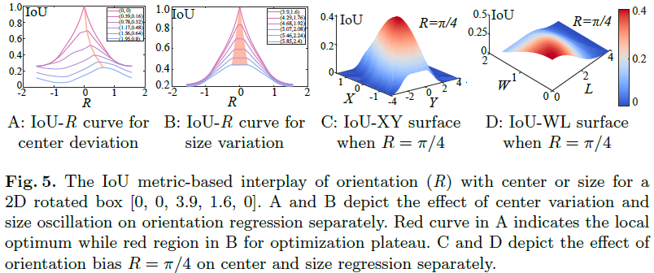

### Overall Loss Function

$$
L_{total}=L_{cls}+L_{iou}+ \lambda(L_{od-iou}+L_{off}+L_{z}+L_{size}+L_{ori)}
$$

## Experiments

- **Training and Inference details**
  - 基于CenterPoint-SECOND设定训练参数(CenterPoint-SECOND and CenterPoint-PointPillars)
  - 基于Afdetv2设定class-specific NMS

- **nuScenes test set**

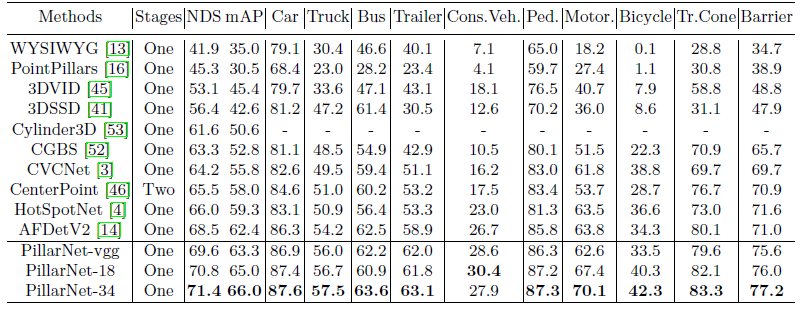

- **Waymo test set**，Single- (upper group) and multi-frame (lower group)

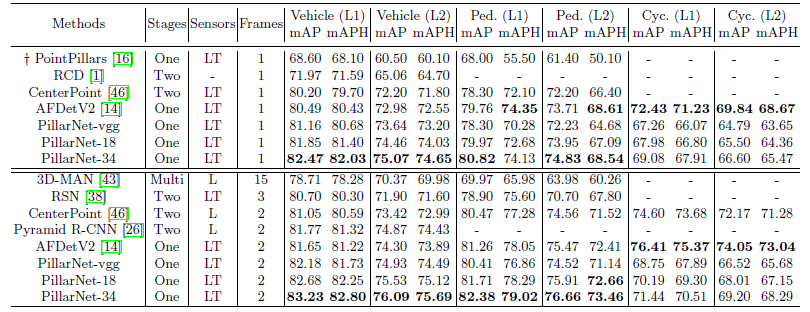

- **Waymo val set**

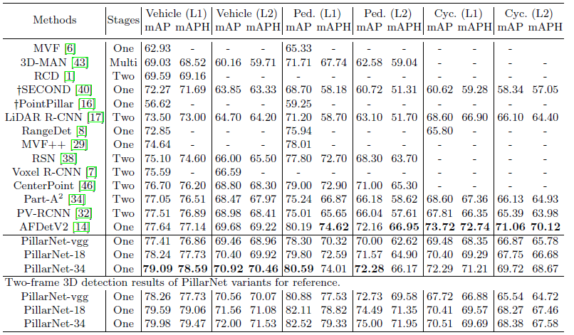

- **Ablation Studies**，on val set of nuScenes

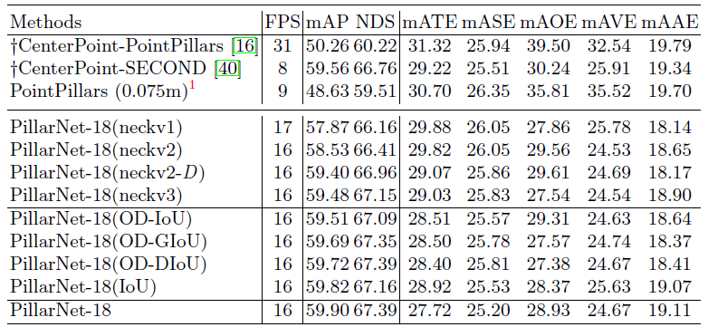

- **Analysis of model variants**

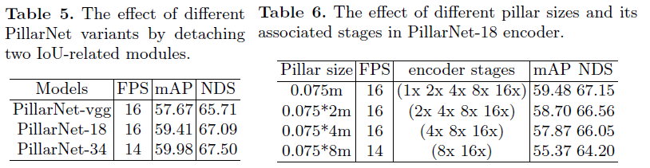

## Conclusions

提出一个real-time and high-performance的基于encoder-neck-head的算法PillarNet