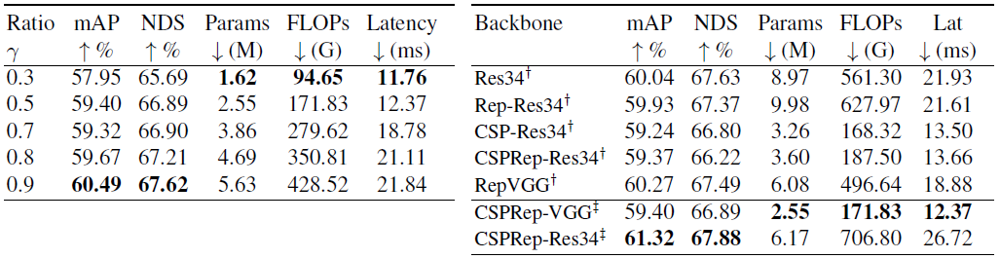

[toc]

# FastPillars: A Deployment-friendly Pillar-based 3D Detector

## Abstract

- 3d 目标检测算法的部署是自动驾驶应用的主要挑战。目前BEV-based的方法倾向于使用稀疏卷积sparse convolution来加速训练和推理，但是造成部署的困难
- 本文使用pillar-based方法，提出Max-and-Attention pillar encoding(MAPE) module、设计了轻量级的CRVNet作为backbone(使用Cross Stage
  Partial network (CSP)
- 实验表明本文的方法FastPillars在on-device speed和performance上都表现出色，在nuScenes上实现64.6 mAP，经过TensorRT部署可达24FPS(RTX3070Ti)
- 代码：https://github.com/StiphyJay/FastPillars

## Introduction

- 与图像相比，点云对光照less sensitive并且具有充足的geometric information，但是因为点云irregular、disordered、sparse，且算法需要higher space dimension的信息，因此更加复杂
- point-based方法直接学习raw point cloud特征以保留original geometry information，但是对部署不太友好
- Voxel-based方法将点云转为grids (如voxels)，然后利用2D/3D CNN提取特征，会造成一些冗余的grids，因此会采用3D sparse convolution来跳过empty grids，但是SP conv对ONNX/TensorRT部署不够友好
- 目前部署较为成熟的方法是pointpillars，将点云转为pillars后用PointNet学习其中的特征，然后用成熟的2d检测pipeline来预测3d框，因为只使用到2d conv，部署十分便利，但是pillars的形式缺少细节信息，难以检测小目标，并且PointPillars的特征融合方式也有待优化
- PillarNet改进了pointpillars：sparse conv based encoder + neck module for feature fusion
- 本文提出一个完全基于标准卷积的FastPillars算法，能够轻松实现部署，主要由4个部分组成：
  - pillar encoding：提出Max-and-Attention Pillar Encoding模块高效学习local geometry(4ms)
  - feature extraction：设计了CRVNet(Cross-Stage-Patrial RepVGG-style Network)
  - feature fusion：fusing features from different levels and receptive fields hierarchically.
  - 3D boxes regression：center-based head

## Related Work

- **Voxel-based 3D Detectors**
  - VoxelNet：Voxel Feature Extractor(VFE) + 3D CNN，其中3D CNN十分耗时
  - SECOND：利用3D sparse convolutions加速训练和推理，不利于embedded systems部署
  - PointPillars：进一步将voxels简化为pillars，用2D CNN做计算
  - CenterPoint：实时的anchor-free pipeline
  - PillarNet：投影点到BEV并且使用2D SPConv

- **Industry-level Lightweight Network**
  - YOLO series的CSPNet
  - RepVGG帮助PPYOLOE、YOLOv6、YOLOv7涨点，并且目前并没有应用到3d检测中

## Our Approach

- 点云：$P= \{ p_{i}= [ x_{i},y_{i},z_{i},r_{i},t_{i}]^{T} \in R^{N \times 5}\}$
- 目标：$B= \{ b_{j}= [ x_{j},y_{j},z_{j},h_{j},w_{j},l_{j},\theta_{j}]^{T} \in R^{M \times 5}\}$

### Max and Attention Pillar Encoding

- MAPE模块由三部分组成：the point encoding unit、the max-pooling encoding unit、the attentive-pooling encoding unit
- 假设当前点云范围$[L\times W\times H]$，点云$P$已被划分为$[v_L,v_W,H]$大小的pillar grid(参照pointpillars)
  - 非空pillars：$v=\{{p}_{i}= [ x_{i},y_{i},z_{i},r_{i},t_{i}]\in R^{N\times 5}\}$
- **Point Encoding**：$ \hat{p}_{i}= \{ [ x_{i},y_{i},z_{i},r_{i},t_{i},x_{i}^{c},y_{i}^{c},z_{i}^{c},x_{i}^{r},y_{i}^{r},z_{i}^{r}]\}\in R^{N\times 11}$
  - 计算每个pillar内点相对于pillar center的偏移、minimums point的偏移
  - 在pillar内不使用任何sampling strategy，以此来保留original geometric patterns
  - point-wise特征 $ \hat{p}_{i}$ 和pillars $v$将通过MLP映射到高维特征空间：$p_{i}^{e}=MLP(\hat{p}_{i};w_{m})$，$w_m$表示可学习的权重
- **Max-pooling Encoding**：将pillar内的所有point feature合并为单一特征：$f^{m}=max(p_{i}^{e})$

- **Attention-pooling Encoding**：用于保留local fine-grained information
  - shared MLP function $g(·)$预测attention scores：$s_{i}=g(p_{i}^{e};w_{g})$，$w_g$表示可学习的权重
  - weighted summed features：$f^{a}= \sum _{i}\frac{s_{i}\cdot p_{i}^{e}}{\sum _{i}s_{j}}$

- 最后结合pillar-wise max-pool特征和attentive pooling特征，取均值$f=\frac{f^m+f^a}2$，获得0.6mAP提升(4ms)

### CRVNet Backbone

- CRVNet (Cross-Stage-Patrial RepVGG-style Network)
  - (a) 训练时RepBlock由一系列RepVGG blocks和激活函数组成
  - (b) 推理时RepVGG block将转为RepConv
  - (c) 每个Repvgg stage有N个RepConvs modules
  - (d) CSPRep Block 通过3个1x1 conv和N个RepConvs组成

- FastPillars-s和FastPillars-m分别由VGG和ResNet-34组成，其中最终性能对early stages更加敏感，因此将VGG stages调整为$(4, 6, 16, 1), (6,16,1,1)$，ResNet-34调整为$(3,4,6,3),(6,6,3,2)$

### Neck and Center-based Heads
- 采用PillarNet的Neck和CenterPoint的Head，以及Afdetv2的IoU-Aware rectification function

### Loss Functions

- 类似CenterPoint，分类focal loss，回归L1 loss，IoU也是L1 loss，还加入DIoU loss

## Experiments

- 基于Det3D框架，训练nuScenes数据集20 epochs，8卡A100 batchsize 32训练25小时

- one-cycle learning rate policy，initial learning rate 1e-4，前40% epochs增加到0.001，随后在剩余的epochs里降低到1e-5，Leaky-ReLU
- 数据增广常见操作，最后5 epochs关闭data augmentation
- 检测范围$[-54,54]\times[-5,3]$，pillar size 0.15

- **State-of-the-art comparisons**

- **speed and accuracy comparison**

- **Inference time breakdowns**

- **Ablation Experiments**
  - **CSP Ratios Selection**：different partial ratios of Cross-Stage-Patrial network(TRT FP16)
  - **Lightweight Backbone**

## Conclusion

提出FastPillars，实现实时的pillar-based 3D detector
