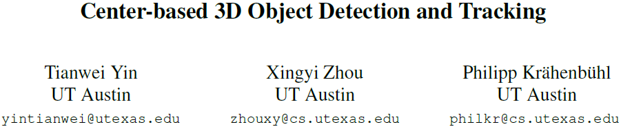

[toc]

# Center-based 3D Object Detection and Tracking

## Abstract

- 3维物体在点云中以3d boxes形式表征，这种形式借鉴了已经非常成熟的图像中的2d bounding-box，但是却有一些其他的问题。朝向(orientation)，box-based方法很难拟合旋转目标
- 本文提出两阶段的keypoint based方法来实现检测和跟踪
- 第一阶段通过keypoint检测到中心点，并回归预测出其他属性，如3D size, 3D orientation, and velocity
- 第二阶段使用目标上的其他point features来优化预测值，再通过greedy closest-point matching实现跟踪
- 在nuscens上单模型达到65.5 NDS，63.8 AMOTA，在waymo上也处于领先
- https://github.com/tianweiy/CenterPoint

## Introduction

- 在点云上的3d目标检测的困难：
  - 点云是稀疏(sparse)的，大多数区域都是without measurements
  - 预测出的box通常不与任何全局坐标系对齐(not well aligned withglobal coordinate)
  - 目标的sizes, shapes, and aspect ratios变化很大

- 2d与3d检测之间的差异导致一些方法表现并不理想(Point-rcnn、Complex-yolo、3dssd)
- axis-aligned 2D box并不能很好地代表free-form 3D object，而引入anchor则会增加计算量，带来大量potential false-positive(R3det、Scrdet)
- 用关键点表示目标能大大简化3d目标的识别
  - 本文提出的方法利用keypoint detector(centernet)找到目标中心点以及其他属性并在第二阶段优化所有预测值
  - 具体来说，使用标准的Lidar-based网络(Second、Voxelnet、Pointpillars)来提取输入点云的特征
  - 然后将特征映射为BEV视角(flattens into map-view)下，并使用image-based网络来预测中心点
  - 对每个中心，用它的点特征回归出其他属性，并使用轻量级二阶段网络来优化
  - 二阶段网络在目标3d box的每个面的中心点提取point-features，用于重建因stride和receptive field而丢失的特征

- 基于中心点的方法的优点
  - 相比于boxes，points没有方向上的限制，减少了算法的search space，使得backbone能学习到目标的旋转不变性和相对旋转的等变性(rotational invariance and rotational equivariance of relative rotation)
  - 中心点的表示方法有利于下游任务的实现，如跟踪
  - 基于点的方法使得特征提取更快、更有效
- 在Waymo和nuScenes数据集上验证了方法的有效性

## Related work

- 2D object detection：从图像中预测axis-algined bounding box。二阶段的RCNN系列，单阶段的YOLO、SSD、RetinaNet系列；基于中心点的CenterNet、CenterTrack等
- 3D object detection：从图像或点云或融合的输入预测rotated bounding boxes，与2d区别在于输入数据的encoder
  - Vote3Deep利用feature-centric voting，VoteNet使用point feature vote clustering
  - VoxelNet利用PointNet提取voxel特征，使用了sparse convolutions和2D convolutions，SECOND提高了sparse 3D convolutions
  - PIXOR将3d投影到2D feature map以减少计算量，额外信息包括3D occupancy and point intensity
  - Pointpillars将voxel替换为pillars提高了运算速度
  - MVF和Pillar-od方法结合multiple view features来学习更加高效的pillar representation
  - 本文的方法只关注output representation，因此对任何3D encoder都兼容

- Two-stage 3D object detection：Pv-rcnn、Pointrcnn、From points to parts、Std等方法，利用了RoIAlign或RoIPool来在3d空间中提取RoI-specific features，但多数耗时太长，因此本文只从5个面中心点提取特征
- 3D object tracking：很多2d跟踪方法都能直接跟踪3d目标，而3D Kalman filters仍具有优势，本文则基于CenterTrack使用速度估计和基于点的检测来跟踪目标

## Preliminaries

- 2D CenterNet
- $w \times h$

## CenterPoint

## Experiments

## Conclusion